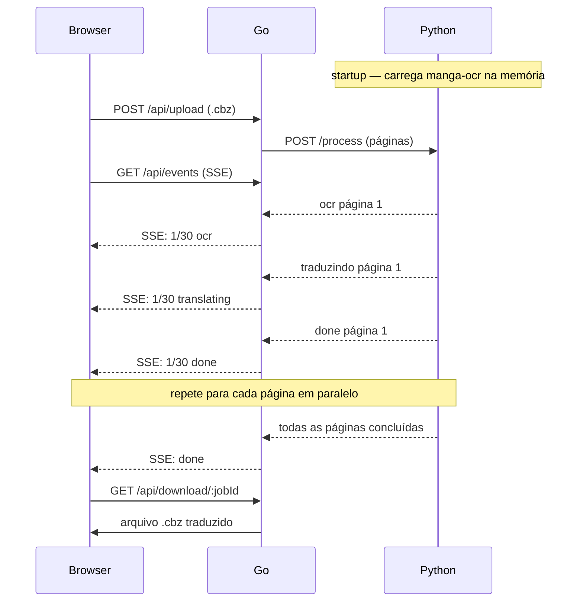

# acerola-translator

**Documento de Arquitetura e Decisões Técnicas**  
_Parte do ecossistema acerola — GPL3_

---

## 1. Visão geral do projeto

O acerola-translator é um serviço local de tradução automática de mangás e webtoons. O usuário abre a interface web, arrasta um arquivo `.cbz` ou `.cbr`, e recebe o arquivo traduzido com os balões redesenhados em português brasileiro.

O projeto faz parte de um ecossistema maior:

- `android-acerola` — leitor Android existente (Kotlin, GPL3)
- `acerola-translator` — este projeto (Go + Python + Svelte, GPL3)
- `acerola-web-reader` — leitor web futuro (GPL3)

A API Go do translator nasce preparada para ser consumida por qualquer cliente HTTP — hoje o browser via Svelte, amanhã o android-acerola, depois o web-reader. O backend não muda, só se adicionam clientes.

---

## 2. O problema que o projeto resolve

Dado um arquivo `.cbz` ou `.cbr` contendo páginas de mangá em japonês:

- Extrair as páginas de imagem do arquivo compactado
- Detectar os balões de fala em cada página
- Executar OCR para extrair o texto japonês de cada balão
- Traduzir o texto para português brasileiro via IA
- Apagar o texto original do balão via inpainting
- Redesenhar o balão com o texto traduzido
- Exportar o arquivo `.cbz` final com todas as páginas processadas

O processamento acontece em paralelo — múltiplas páginas ao mesmo tempo — com progresso visível no browser em tempo real.

---

## 3. Arquitetura final

| Camada | Tecnologia | Responsabilidade |
|---|---|---|
| Frontend | Svelte 5 + TypeScript | UI, upload, progresso SSE, download |
| Orchestrador | Go + net/http | Servidor HTTP, gerencia jobs, SSE, proxy IA |
| Processamento | Python + FastAPI | OCR, detecção de balões, inpainting, rendering |
| OCR | manga-ocr | Extração de texto japonês de mangá |
| Detecção | OpenCV | Detecção de contornos dos balões |
| Tradução | go-openai (multi-provedor) | Interface unificada para Claude, Ollama, OpenAI |
| Distribuição | Docker Compose | Empacota Go + Python juntos |

### 3.1 Por que Go + Python e não só um deles

Go e Python têm naturezas opostas que se complementam nessa arquitetura:

- **Go** é excelente para: servidor HTTP de alta concorrência, gerenciar múltiplos jobs simultaneamente, SSE para o browser, chamadas à API de IA, servir arquivos estáticos embutidos com `embed.FS`
- **Python** é insubstituível para: manga-ocr (modelo treinado especificamente para mangá), OpenCV com API madura, ecossistema de ML que não existe em Go

O Python não roda como subprocess (`exec.Command`) — essa abordagem pagaria o custo de inicialização do modelo a cada job. O Python sobe como um servidor FastAPI interno na porta 8001, carrega o manga-ocr uma vez na memória, e fica disponível para o Go chamar via HTTP. Go é o gerente, Python é o operário especializado.

### 3.2 Fluxo de dados completo



O Python nunca fala com o browser. O browser nunca fala com o Python. Go é o único ponto de contato dos dois lados.

---

## 4. Tradeoffs analisados

### 4.1 Linguagem de backend

| Opção | Prós | Contras | Veredicto |
|---|---|---|---|
| Python | manga-ocr nativo, OpenCV maduro, sem fricção com ML | Distribuição mais complexa (PyInstaller) | ✅ Escolhido para processamento |
| Go | Concorrência excelente, binário limpo, HTTP nativo | Ecossistema de ML inexistente | ✅ Escolhido para orchestração |
| Rust | Máxima performance, segurança de memória | Curva alta, ML inexistente | ❌ Overkill para uso local |
| C / C++ | Performance máxima, domínio do autor | Servidor HTTP e JSON manual é masoquismo | ❌ Sem ganho real |

### 4.2 OCR

| Opção | Prós | Contras | Veredicto |
|---|---|---|---|
| manga-ocr | Melhor qualidade, treinado para mangá, lida com texto vertical | Só existe em Python | ✅ Escolhido |
| Claude Vision | Zero dependência, OCR + tradução num request | Custo por balão, precisa de internet | ⚠️ Fallback viável |
| Tesseract cgo | Funciona em Go nativo | Qualidade ruim para japonês de mangá | ❌ Descartado |
| ONNX direto em Go | Elimina Python da stack | Tokenizer japonês + beam search na mão — semanas de trabalho | ❌ Descartado |

### 4.3 Detecção de balões

| Opção | Prós | Contras | Veredicto |
|---|---|---|---|
| OpenCV contornos | Simples, funciona bem em mangá com fundo branco | Falha em fundos complexos e balões sobrepostos | ✅ Fase 1 |
| YOLO treinado | Alta precisão, lida com casos difíceis | Precisa de modelo pré-treinado ou treinamento | ✅ Fase 2 — evolução natural |

### 4.4 Tradução via IA

| Opção | Prós | Contras | Veredicto |
|---|---|---|---|
| Ollama local | Grátis, offline, zero latência de rede | Qualidade inferior ao Claude em nuance de mangá | ✅ Default — grátis |
| Claude API | Melhor compreensão de contexto, gírias, expressões | Custo por request, precisa de internet | ✅ Opcional — melhor qualidade |
| OpenAI API | Boa qualidade, amplamente suportado | Custo por request | ✅ Suportado via go-openai |
| DeepL API | Especializado em tradução formal | Fraco em linguagem informal de mangá | ❌ Descartado |

### 4.5 Interface de usuário

| Opção | Prós | Contras | Veredicto |
|---|---|---|---|
| Svelte 5 + TypeScript | Mínimo overhead, TypeScript nativo, componentes limpos | Svelte 5 tem sintaxe nova (runes) | ✅ Escolhido |
| Wails v2 | Go backend + frontend web, binário único | Só faz sentido com backend Go puro — sem Python | ❌ Descartado |
| Tauri | Rust backend + frontend web, binário leve | Dois backends (Rust + Go) sem motivo | ❌ Descartado |
| Fyne / Gio | UI nativa Go | Visual datado, rendering de imagem fraco | ❌ Descartado |

### 4.6 Multi-provedor de IA

O AI SDK da Vercel foi considerado mas descartado — é TypeScript/JavaScript e exigiria um processo Node extra apenas para chamar APIs. A alternativa em Go é o `go-openai`, que funciona com qualquer provedor compatível com o protocolo OpenAI:

- Claude API — proxy OpenAI-compatible via anthropic
- Ollama — fala o protocolo OpenAI na porta 11434
- OpenAI — nativo
- Groq, Together, qualquer provider OpenAI-compatible

Troca de provedor com uma linha de configuração, sem reescrever nada do pipeline.

---

## 5. Estrutura do projeto

```
acerola-translator/
├── cmd/
│   └── main.go                  ← entrypoint, sobe HTTP + spawna Python
├── internal/
│   ├── archive/                 ← lê CBZ (zip nativo) e CBR (rardecode)
│   ├── pipeline/                ← goroutines, worker pool, canal de jobs
│   ├── ai/                      ← go-openai, multi-provedor
│   ├── exporter/                ← gera CBZ final
│   └── types/                   ← structs compartilhados
├── python/
│   ├── worker.py                ← FastAPI interno porta 8001
│   ├── detector.py              ← OpenCV, detecção de balões
│   ├── ocr.py                   ← manga-ocr wrapper
│   ├── inpaint.py               ← apaga texto original
│   └── renderer.py              ← redesenha texto traduzido
├── frontend/
│   ├── src/
│   │   ├── lib/
│   │   │   ├── Upload.svelte
│   │   │   ├── Progress.svelte
│   │   │   └── Viewer.svelte
│   │   └── App.svelte
│   ├── package.json
│   └── vite.config.ts
├── docker-compose.yml
├── go.mod
└── go.sum
```

---

## 6. Decisões de design que não são óbvias

### 6.1 Go como orchestrador, não só servidor

Go não é um load balancer — é um orchestrador com lógica de negócio. Ele valida o arquivo recebido, gerencia o estado do job, distribui trabalho ao Python, agrega resultados, e responde ao cliente. Um load balancer puro como Nginx não sabe o que está distribuindo. Go sabe.

A analogia correta: **Go é o gerente de produção. Python é o operário especializado.** O gerente não solda, não pinta, não faz trabalho pesado. Ele recebe pedidos, organiza a fila, manda pro operário certo, acompanha o progresso, entrega o resultado. Quando você tem um operário e um pedido — o gerente é overhead. Quando você tem cem pedidos e dez operários — sem gerente vira caos.

### 6.2 Python como servidor interno, não subprocess

manga-ocr leva 3-5 segundos para carregar o modelo na memória. Chamar `exec.Command` a cada job pagaria esse custo toda vez. O Python sobe uma vez com FastAPI, carrega o modelo, e fica quente para o Go chamar. Jobs subsequentes respondem em milissegundos.

### 6.3 SSE em vez de WebSocket

Server-Sent Events é unidirecional — servidor para cliente. Para streaming de progresso, isso é tudo que precisamos. WebSocket adiciona complexidade de protocolo bidirecional sem benefício real para esse caso de uso.

### 6.4 embed.FS — frontend dentro do binário Go

O Svelte buildado (`dist/`) é embutido no binário Go em compile time com a diretiva `//go:embed`. O executável final serve o frontend da memória sem precisar de pasta separada, servidor de arquivos externo ou instalação de Node na máquina de destino.

```go
//go:embed all:frontend/dist
var assets embed.FS

http.Handle("/", http.FileServer(http.FS(assets)))
```

### 6.5 Docker só depois que funciona local

Containerizar algo quebrado esconde o problema. Docker entra depois que o projeto funciona localmente — não antes. Quando entrar, o `docker-compose` orquestra Go + Python como dois containers com rede interna, sem expor a porta 8001 do Python para o mundo.

---

## 7. Ordem de implementação recomendada

| Fase | O que implementar | O que aprende |
|---|---|---|
| 1 | Go: servidor HTTP + rota health check + serve arquivo estático | Estrutura de projeto Go, go.mod, net/http |
| 2 | Python: FastAPI + endpoint /process que retorna JSON mockado | FastAPI, como Go e Python se comunicam via HTTP |
| 3 | Go: recebe CBZ, extrai páginas, manda para Python, recebe resposta | archive/zip, http.Post, goroutines básicas |
| 4 | Python: OpenCV detectando contornos reais de balões | OpenCV, detecção de contornos, crop de imagem |
| 5 | Python: manga-ocr extraindo texto dos balões detectados | manga-ocr, pipeline OCR completo |
| 6 | Go: SSE enviando progresso para o browser | Server-Sent Events, http.Flusher, channels |
| 7 | Go: ai/ com go-openai chamando Ollama local | go-openai, multi-provedor, context cancelamento |
| 8 | Python: inpainting + renderer com freetype | Pillow, inpainting, rendering de texto em imagem |
| 9 | Svelte: Upload + Progress + Viewer consumindo a API Go | Svelte 5 runes, TypeScript, fetch, EventSource |
| 10 | Docker Compose empacotando tudo | Docker multi-stage build, redes internas |

---

## 8. Visão do ecossistema acerola

O translator foi desenhado para ser um serviço consumível, não um app isolado. A API Go expõe endpoints HTTP simples que qualquer cliente pode consumir:

- `POST /api/upload` — recebe o .cbz, inicia job, retorna jobId
- `GET /api/events` — SSE com progresso em tempo real
- `GET /api/download/:jobId` — retorna o .cbz traduzido

Isso significa que o android-acerola pode integrar o translator sem reescrever o backend — apenas adicionar chamadas HTTP à API já existente. O acerola-web-reader idem. Uma API, múltiplos clientes.

| Projeto | Linguagem | Consome a API do translator? |
|---|---|---|
| android-acerola | Kotlin | Sim — HTTP direto para Go |
| acerola-translator | Go + Python + Svelte | É a API |
| acerola-web-reader | A definir | Sim — mesmo endpoint |

---

_acerola-translator — documento gerado a partir de sessão de arquitetura_  
_Licença GPL3 — parte do ecossistema acerola_
